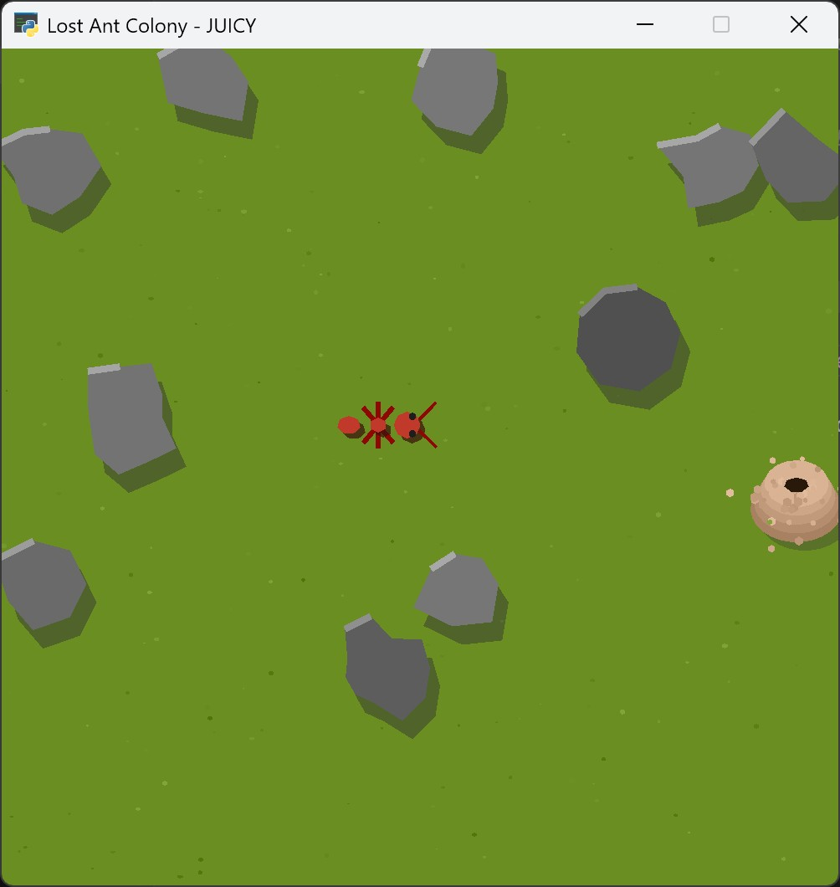

# MLV-Lab: Ecosistema Educativo de IA Visual

[](https://opensource.org/licenses/MIT)
[](https://www.python.org/)
[](https://pypi.org/project/mlvlab/)
&nbsp;&nbsp;&nbsp;&nbsp;
[](../README.md)
[](./README_es.md)

> **La Misión:** Democratizar y concienciar sobre el desarrollo de la Inteligencia Artificial a través de la experimentación visual e interactiva.

MLV-Lab es un ecosistema pedagógico diseñado para explorar los conceptos fundamentales de la IA sin necesidad de conocimientos matemáticas avanzados. Nuestra filosofía es **"Show, don't tell"**: pasamos de la teoría abstracta a la práctica concreta y visual.

Este proyecto tiene dos audiencias principales:
1.  **Entusiastas de la IA:** Una herramienta para jugar, entrenar y observar agentes inteligentes resolviendo problemas complejos desde la terminal.
2.  **Desarrolladores de IA:** Un *sandbox* con entornos estándar (compatibles con [Gymnasium](https://gymnasium.farama.org/)) para diseñar, entrenar y analizar agentes desde cero.

---

## 🚀 Uso Rápido (Shell Interactivo)

MLV-Lab se controla a través de un shell interactivo llamado `MLVisual`. El flujo de trabajo está diseñado para ser intuitivo y fácil de usar.

**Requisito:** Python 3.10+

### 1. Instalación con uv

```bash
# Instalar el gestor de paquetes uv
pip install uv

# Crear un entorno virtual dedicado
uv venv

# Instalar mlvlab en el entorno virtual
uv pip install mlvlab

# Para desarrollo (instalación local)
uv pip install -e ".[dev]"

# Lanzar el shell interactivo
uv run mlv shell
```

### 2. Flujo de Trabajo del Shell Interactivo

Una vez que estés en el shell <b>`MLVLab>`</b>:

```bash
list                    # Descubre las unidades disponibles
list ants               # Lista entornos de una unidad específica
play <env>              # Juega para entender el objetivo
train <env>             # Entrena un agente con una semilla específica
eval <env>              # Evalúa el entrenamiento visualmente
view <env>              # Crea una vista interactiva de la simulación
docs <env>              # Consulta la ficha técnica y documentación
config <args>           # Gestiona la configuración
clear                   # Reinicia los mensajes de la terminal
exit                    # Sale del shell (o usa 'quit')
```

**Ejemplo de sesión:**
```bash
play AntScout-v1
train AntScout-v1 --seed 123
eval AntScout-v1 --seed 123
view AntScout-v1
docs AntScout-v1
exit
```

---
## 📦 Entornos disponibles

| Saga | Entorno    | ID (Gym)                | Baseline    | Detalles |  |
|------|-----------|-----------------------------|------------|----------------|--------------|
| 🐜 Hormigas | Vigía Rastreadora | `mlv/AntScout-v1` | Q-Learning | [README_es.md](../mlvlab/envs/ant_scout_v1/README_es.md) | <a href="../mlvlab/envs/ant_scout_v1/README_es.md"></a> |

---

## 💻 Desarrollo de Agentes (API)

Puedes usar los entornos de MLV-Lab en tus propios proyectos de Python como cualquier otra librería de Gymnasium.

### 1. Instalación en tu Proyecto

```bash
# Crea tu entorno virtual y luego instala las dependencias
pip install -U mlvlab
```

### 2. Uso en tu Código

```python
import gymnasium as gym
import mlvlab  # ¡Importante! Esto registra los entornos "mlv/..." y mantiene compatibilidad con los antiguos

# Crea el entorno como lo harías normalmente con Gymnasium
env = gym.make("mlv/AntScout-v1", render_mode="human")
obs, info = env.reset()

for _ in range(100):
    # Aquí es donde va tu lógica para elegir una acción
    action = env.action_space.sample() 
    obs, reward, terminated, truncated, info = env.step(action)
    
    if terminated or truncated:
        obs, info = env.reset()

env.close()
```

---

## ⚙️ Comandos del Shell: list, play, train, eval, view, docs, config

### Comando lista: `list [unidad]`

Devuelve un listado de las categorías de entornos disponibles o entornos de una unidad específica.

- **Uso básico**: `list`
- **Opciones**: ID de la categoría a filtrar (ej. `list ants`).

Ejemplos:

```bash
list
list ants
```

### Comando juego: `play <env-id> [opciones]`

Ejecuta el entorno en modo interactivo (humano) para probar el control manual.

- **Uso básico**: `play <env-id>`
- **Parámetros**:
  - **env_id**: ID del entorno (ej. `AntScout-v1`).
  - **--seed, -s**: Semilla para reproducibilidad del mapa. Si no se especifica, se usa la predeterminada del entorno.

Ejemplo:

```bash
play AntScout-v1 --seed 42
```

### Comando entrenamiento: `train <env-id> [opciones]`

Entrena el agente baseline del entorno y guarda los pesos/artefactos en `data/<env>/<seed-XYZ>/`.

- **Uso básico**: `train <env-id>`
- **Parámetros**:
  - **env_id**: ID del entorno.
  - **--seed, -s**: Semilla del entrenamiento. Si no se indica, se genera una aleatoria y se muestra por pantalla.
  - **--eps, -e**: Número de episodios (sobrescribe el valor de la configuración baseline del entorno).
  - **--render, -r**: Renderiza el entrenamiento en tiempo real. Nota: esto puede ralentizar significativamente el entrenamiento.

Ejemplo:

```bash
train AntScout-v1 --seed 123 --eps 500 --render
```

### Comando evaluación: `eval <env-id> [opciones]`

Evalúa un entrenamiento existente cargando la Q-Table/pesos desde el directorio de `run` correspondiente. Por defecto, se abre la ventana (modo `human`) y se visualiza al agente usando sus pesos. Para grabar un vídeo en disco, añade `--rec`.

- **Uso básico**: `eval <env-id> [opciones]`
- **Parámetros**:
  - **env_id**: ID del entorno.
  - **--seed, -s**: Semilla del `run` a evaluar. Si no se indica, se usa el último `run` disponible para ese entorno.
  - **--eps, -e**: Número de episodios a ejecutar durante la evaluación. Por defecto: 5.
  - **--rec, -r**: Graba y genera un vídeo de la evaluación (en `evaluation.mp4` dentro del directorio del `run`). Si no se especifica, solo se muestra la ventana interactiva y no se guardan vídeos.
  - **--speed, -sp**: Factor de multiplicación de velocidad, por defecto es `1.0`, para verlo a la mitad poner `.5`.

Ejemplos:

```bash
# Visualizar el agente usando los pesos del último entrenamiento
eval AntScout-v1

# Visualizar un entrenamiento concreto y grabar vídeo
eval AntScout-v1 --seed 123 --rec

# Evaluar 10 episodios
eval AntScout-v1 --seed 123 --eps 10 --rec
```

### Comando vista interactiva: `view <env-id>`

Lanza la vista interactiva (Analytics View) del entorno con controles de simulación, métricas y gestión de modelos.

- Uso básico: `view <env-id>`

Ejemplo:

```bash
view AntScout-v1
```

### Comando documentación: `docs <env-id>`

Abre un navegador con el archivo `README.md` asociado al entorno, mostrando todos los detalles.
Además, muestra un resumen en la terminal en el idioma configurado:

- **Uso básico**: `docs <env-id>`

Example:

```bash
docs AntScout-v1
```

### Comando configuración: `config <acción> [clave] [valor]`

Gestiona la configuración de MLV-Lab incluyendo la configuración del idioma (el paquete detecta el idioma del sistema automáticamente):

- **Uso básico**: `config <acción> [clave] [valor]`
- **Acciones**:
  - **get**: Mostrar configuración actual o clave específica
  - **set**: Establecer un valor de configuración
  - **reset**: Restablecer configuración a valores predeterminados
- **Claves comunes**:
  - **locale**: Configuración del idioma (`en` para inglés, `es` para español)

Ejemplos:

```bash
# Mostrar configuración actual
config get

# Mostrar configuración específica
config get locale

# Establecer idioma a español
config set locale es

# Restablecer a valores predeterminados
config reset
```

---

## 🛠️ Contribuir a MLV-Lab

Si quieres añadir nuevos entornos o funcionalidades al núcleo de MLV-Lab:

1.  Clona el repositorio.
2.  Crea un entorno virtual con uv.
   
    ```bash
    uv venv
    ``` 

3.  Instala el proyecto en modo editable con las dependencias de desarrollo:

    ```bash
    uv pip install -e ".[dev]"
    ```

4.  Lanza el shell de desarrollo:

    ```bash
    uv run mlv shell
    ```

Esto instala `mlvlab` (modo editable) y también las herramientas del grupo `[dev]`.

---

## 🌍 Internacionalización

MLV-Lab soporta múltiples idiomas. El idioma por defecto es inglés `en`, y el español `es` está completamente soportado como idioma alternativo.

### Configuración de Idioma

El idioma se puede establecer de dos formas:

1. **Detección Automática:**
  El sistema detecta automáticamente el idioma de tu sistema y usa español si está disponible, de lo contrario usa inglés por defecto.

2. **Cambio Manual de Idioma:**
  Se puede forzar el idioma deseado en caso de que no se corresponda con las preferencias del usuario:

   ```bash
   # Lanza una ventana interactiva
   uv run mlv shell

   # Establece el idioma en Inglés
   config set locale en

   # Establece el idioma en Español
   config set locale es
   ```

### Idiomas disponibles

- **Inglés (`en`)**: Idioma por defecto.
- **Español (`es`)**: Idioma alternativo completamente traducido.