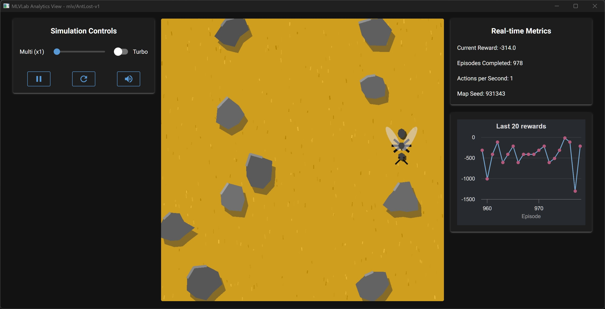

# AntLost-v1: Usage Guide

[](./README.md)
[](./README_es.md)

This file documents the `mlv/AntLost-v1` environment, also known as **Errant Drone**.



## Description

In this environment, an agent (the ant) is placed on a 10x10 grid with no specific objective. The ant wanders aimlessly until it reaches the maximum number of steps allowed, demonstrating the concept of **chaotic movement** and the need for intelligent behavior.

This is a **conceptual environment** designed to introduce the fundamental concepts of reinforcement learning without the complexity of goal-oriented behavior. It serves as a foundation for understanding the basic vocabulary and mechanics of RL environments.

---

## Learning Objectives

This environment is designed to achieve the following educational goals:

1. **Setup Objective**: Mount the development environment and understand the "contract" of communication between a simulation and a control interface.

2. **Theoretical Foundation**: Introduce fundamental theoretical concepts (Agent, Environment, State, Action, Reward).

3. **Problem Statement**: Establish the problem: The chaotic movement of the disoriented ant creates the need to replace it with intelligence.

4. **Final Result**: A 100% functional development environment and comprehension of essential RL vocabulary.

---

## Technical Specifications

### Observation Space

The observation space defines what the agent "sees" at each step.
```
Box(0, 9, (2,), int32)
```
* **Meaning:** The observation is a vector with 2 integers representing the ant's position `[x, y]` on the grid.
* **Bounds:** Each coordinate ranges from 0 to 9, corresponding to a 10x10 grid.
* **Total States:** $10 \times 10 = 100$ unique possible states.

### Action Space

The action space defines what movements the agent can perform.
```
Discrete(4)
```
* **Meaning:** The agent can choose one of 4 discrete actions, represented by an integer:
    * `0`: Move **Up** (decreases the `y` coordinate)
    * `1`: Move **Down** (increases the `y` coordinate)
    * `2`: Move **Left** (decreases the `x` coordinate)
    * `3`: Move **Right** (increases the `x` coordinate)

---

## Environment Dynamics

### Rewards

The agent receives a signal (reward) after each action:
* **`-1`**: For each step taken. This represents the cost of movement and time.
* **`-100`**: For hitting an obstacle or moving out of bounds (if any obstacles are present).

**Note:** This environment is designed to demonstrate reward mechanics and can be modified using wrappers to explore different reward structures.

### Episode End (Termination & Truncation)

An "episode" (a wandering session) ends under the following conditions:
* **`terminated = False`**: This environment never terminates successfully - there is no goal to reach.
* **`truncated = True`**: The agent reaches the maximum step limit (`max_episode_steps=20` by default, but configurable). This represents the ant's "death" from exhaustion.

**Important note:** This environment is designed to always end with `truncated = True`, demonstrating the concept of episode truncation in reinforcement learning.

---

## Additional Information (`info`)

Both `reset()` and `step()` return an **`info`** dictionary, useful for debugging and understanding environment mechanics.

---

### In `reset()`
| Key        | Description                                  |
|------------|----------------------------------------------|
| `episode`  | Episode counter (starts at 0).              |

---

### In `step()`
| Key          | Description |
|--------------|-------------|
| `episode`    | Current episode number. |
| `step`       | Current step within the episode. |
| `collided`   | `True` if the ant collided with an obstacle or moved out of the grid boundaries. |
| `terminated` | Always `False` in this environment. |
| `truncated`  | `True` if the episode ended due to step limit. |
| `play_sound` | Dictionary with sound information:<br>• `{'filename': 'fail.wav', 'volume': 10}` → when the maximum number of steps is reached.<br>• `{'filename': 'bump.wav', 'volume': 7}` → when an obstacle is hit. |

---

## Recommended Training Strategy

### Algorithm: Random Agent (Baseline)

This environment is designed to demonstrate the **baseline behavior** of a random agent. The ant's movement is governed by random actions, showcasing:

1. **Chaotic Movement**: The ant wanders without purpose or direction.
2. **Inefficiency**: Random actions lead to inefficient exploration.
3. **The Need for Intelligence**: The random behavior clearly demonstrates why intelligent agents are necessary.

### Learning Opportunities

While this environment doesn't have a traditional "success" condition, it provides excellent opportunities to learn:

1. **Reward Engineering**: Modify rewards using wrappers to explore different reward structures.
2. **Episode Management**: Understand the difference between termination and truncation.
3. **Environment Mechanics**: Learn how to interact with Gymnasium environments.
4. **State Representation**: Understand how observations represent the agent's state.

---

## Shell Usage Examples

```bash
# Start the MLVisual shell
uv run mlv shell

# Play interactively in the environment
play AntLost-v1

# Train with a random agent (demonstrates chaotic behavior)
train AntLost-v1 --seed 42

# Train with a random seed
train AntLost-v1

# Evaluate the random agent in window mode
eval AntLost-v1

# Evaluate with a specific seed
eval AntLost-v1 --seed 42

# Evaluate 100 episodes
eval AntLost-v1 --seed 42 --eps 100

# Launch an interactive view to manipulate the environment using controls
view AntLost-v1

# View this technical specification from the terminal
docs AntLost-v1
```

---

## Scripts and Notebook Compatibility

You can use **mlvlab** both in standalone scripts and interactive environments (Jupyter, Google Colab, etc.).  

---

### 1. Using Python Scripts

Create a dedicated virtual environment and install `mlvlab`:

```bash
# (Optional) Create a dedicated virtual environment
uv venv

# Install mlvlab inside that virtual environment
uv pip install mlvlab

# Run your script within the virtual environment
uv run python my_script.py
```

### 2. Using Jupyter Notebooks

Simply select your virtual environment as the kernel, or launch Jupyter with:

```bash
uv run jupyter notebook
```

### 3. Using Google Colab

Install `mlvlab` directly in the Colab session:

```bash
!pip install mlvlab
```

### Quick examples for notebooks

```python
# Run a random episode (demonstrates chaotic movement)
import gymnasium as gym
import mlvlab  # registers the "mlv/..." environments

env = gym.make("mlv/AntLost-v1", render_mode="human")
obs, info = env.reset(seed=42)
terminated = truncated = False

while not (terminated or truncated):
    action = env.action_space.sample()  # Random actions
    obs, reward, terminated, truncated, info = env.step(action)
    print(f"Position: {obs}, Reward: {reward}, Step: {info['step']}")
env.close()
```

```python
# Demonstrate reward modification using wrappers
import gymnasium as gym
import mlvlab
from gymnasium.wrappers import TransformReward

# Create environment with modified rewards
env = gym.make("mlv/AntLost-v1")
env = TransformReward(env, lambda r: r * 2)  # Double all rewards

obs, info = env.reset(seed=42)
terminated = truncated = False

while not (terminated or truncated):
    action = env.action_space.sample()
    obs, reward, terminated, truncated, info = env.step(action)
    print(f"Modified reward: {reward}")
env.close()
```

```python
# Analyze episode statistics
import gymnasium as gym
import mlvlab
import numpy as np

env = gym.make("mlv/AntLost-v1")
episodes = 10
total_rewards = []
episode_lengths = []

for episode in range(episodes):
    obs, info = env.reset(seed=episode)
    episode_reward = 0
    step_count = 0
    terminated = truncated = False
    
    while not (terminated or truncated):
        action = env.action_space.sample()
        obs, reward, terminated, truncated, info = env.step(action)
        episode_reward += reward
        step_count += 1
    
    total_rewards.append(episode_reward)
    episode_lengths.append(step_count)

env.close()

print(f"Average reward: {np.mean(total_rewards):.2f}")
print(f"Average episode length: {np.mean(episode_lengths):.2f}")
print(f"Total steps across all episodes: {sum(episode_lengths)}")
```

```python
# Using custom reward wrapper
from mlvlab.envs.ant_lost_v1.reward_wrapper import AntLostRewardWrapper
import gymnasium as gym
import mlvlab

# Create environment with custom rewards
env = gym.make("mlv/AntLost-v1")
env = AntLostRewardWrapper(env)  # Now rewards are: -1 per step, -100 for obstacle, -1000 for death

obs, info = env.reset(seed=42)
terminated = truncated = False

while not (terminated or truncated):
    action = env.action_space.sample()
    obs, reward, terminated, truncated, info = env.step(action)
    print(f"Position: {obs}, Reward: {reward}")
env.close()
```

**Suggestion**: Use this environment to experiment with different reward structures, episode lengths, and to understand the fundamental mechanics of reinforcement learning environments before moving to more complex goal-oriented scenarios.
