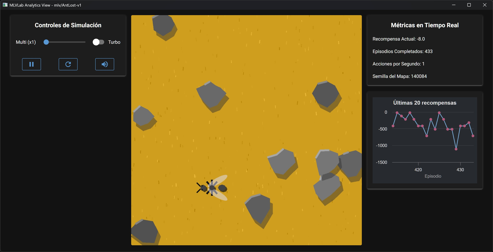

# AntLost-v1 (Zángano Errante): Guía de Uso

[](./README.md)
[](./README_es.md)

Este fichero documenta el entorno `mlv/AntLost-v1`, también conocido como **Zángano Errante**.



## Descripción

En este entorno, un agente (la hormiga) se encuentra en una rejilla de 10x10 sin un objetivo específico. La hormiga vaga sin rumbo hasta alcanzar el número máximo de pasos permitidos, demostrando el concepto de **movimiento caótico** y la necesidad de comportamiento inteligente.

Este es un **entorno conceptual** diseñado para introducir los conceptos fundamentales del aprendizaje por refuerzo sin la complejidad del comportamiento orientado a objetivos. Sirve como base para entender el vocabulario básico y la mecánica de los entornos de RL.

---

## Objetivos de Aprendizaje

Este entorno está diseñado para lograr los siguientes objetivos educativos:

1. **Objetivo de Configuración**: Montar el entorno de desarrollo y entender el "contrato" de comunicación entre una simulación y una interfaz de control.

2. **Fundamento Teórico**: Introducir los conceptos teóricos fundamentales (Agente, Entorno, Estado, Acción, Recompensa).

3. **Establecimiento del Problema**: Establecer el problema: El movimiento caótico de la hormiga desorientada crea la necesidad de reemplazarlo por inteligencia.

4. **Resultado Final**: Un entorno de desarrollo 100% funcional y la comprensión del vocabulario esencial del RL.

---

## Ficha Técnica

### Observation Space

El espacio de observación define lo que el agente "ve" en cada paso.
```
Box(0, 9, (2,), int32)
```
* **Significado:** La observación es un vector con 2 números enteros, que representan la posición `[x, y]` de la hormiga en la rejilla.
* **Límites:** Cada coordenada va de 0 a 9, correspondiendo a una rejilla de 10x10.
* **Total de Estados:** $10 \times 10 = 100$ estados únicos posibles.

### Action Space

El espacio de acciones define qué movimientos puede realizar el agente.
```
Discrete(4)
```
* **Significado:** El agente puede elegir una de 4 acciones discretas, representadas por un número entero:
    * `0`: Moverse **Arriba** (disminuye la coordenada `y`)
    * `1`: Moverse **Abajo** (aumenta la coordenada `y`)
    * `2`: Moverse a la **Izquierda** (disminuye la coordenada `x`)
    * `3`: Moverse a la **Derecha** (aumenta la coordenada `x`)

---

## Dinámica del Entorno

### Recompensas (Rewards)

El agente recibe una señal (recompensa) después de cada acción:
* **`-1`**: Por cada paso que da. Esto representa el costo del movimiento y el tiempo.
* **`-100`**: Por chocar contra un obstáculo o salir de los límites (si hay obstáculos presentes).

**Nota:** Este entorno está diseñado para demostrar la mecánica de recompensas y puede ser modificado usando wrappers para explorar diferentes estructuras de recompensas.

### Fin del Episodio (Termination & Truncation)

Un "episodio" (una sesión de vagabundeo) termina bajo las siguientes condiciones:
* **`terminated = False`**: Este entorno nunca termina exitosamente - no hay meta que alcanzar.
* **`truncated = True`**: El agente alcanza el límite máximo de pasos (`max_episode_steps=20` por defecto, pero configurable). Esto representa la "muerte" de la hormiga por agotamiento.

**Nota importante:** Este entorno está diseñado para siempre terminar con `truncated = True`, demostrando el concepto de truncación de episodios en el aprendizaje por refuerzo.

---

## Información Adicional (`info`)

Tanto `reset()` como `step()` devuelven un diccionario **`info`**, útil para depuración y comprensión de la mecánica del entorno.

---

### En `reset()`
| Clave              | Descripción                                        |
|---------------------|----------------------------------------------------|
| `episode`          | Contador de episodios (comienza en 0).            |

---

### En `step()`
| Clave              | Descripción |
|---------------------|-------------|
| `episode`          | Número de episodio actual. |
| `step`             | Paso actual dentro del episodio. |
| `collided`         | `True` si la hormiga colisiona o sale de los límites del grid. |
| `terminated`       | Siempre `False` en este entorno. |
| `truncated`        | `True` si el episodio terminó debido al límite de pasos. |
| `play_sound`       | Diccionario con información de sonido:<br>• `{'filename': 'fail.wav', 'volume': 10}` → al superarse el límite de pasos.<br>• `{'filename': 'bump.wav', 'volume': 7}` → al colisionar con un obstáculo. |

---

## Estrategia de Entrenamiento Recomendada

### Algoritmo: Agente Aleatorio (Línea Base)

Este entorno está diseñado para demostrar el **comportamiento de línea base** de un agente aleatorio. El movimiento de la hormiga está gobernado por acciones aleatorias, mostrando:

1. **Movimiento Caótico**: La hormiga vaga sin propósito ni dirección.
2. **Ineficiencia**: Las acciones aleatorias llevan a una exploración ineficiente.
3. **La Necesidad de Inteligencia**: El comportamiento aleatorio demuestra claramente por qué son necesarios los agentes inteligentes.

### Oportunidades de Aprendizaje

Aunque este entorno no tiene una condición de "éxito" tradicional, proporciona excelentes oportunidades para aprender:

1. **Ingeniería de Recompensas**: Modificar recompensas usando wrappers para explorar diferentes estructuras de recompensas.
2. **Gestión de Episodios**: Entender la diferencia entre terminación y truncación.
3. **Mecánica del Entorno**: Aprender cómo interactuar con entornos de Gymnasium.
4. **Representación de Estados**: Entender cómo las observaciones representan el estado del agente.

---

## Ejemplos de Uso con el Shell

```bash
# Inicia la terminal de MLVisual
uv run mlv shell

# Jugar interactivamente en el entorno
play AntLost-v1

# Entrenar con un agente aleatorio (demuestra comportamiento caótico)
train AntLost-v1 --seed 42

# Entrenar con una semilla aleatoria
train AntLost-v1

# Evaluar el agente aleatorio en modo ventana
eval AntLost-v1

# Evaluar con una semilla específica
eval AntLost-v1 --seed 42

# Evaluar 100 episodios
eval AntLost-v1 --seed 42 --eps 100

# Lanza una vista interactiva para manipular el entorno usando controles
view AntLost-v1

# Ver esta ficha técnica desde la terminal
docs AntLost-v1
```

---

## Compatibilidad con Scripts y Notebooks

Puedes usar **mlvlab** tanto en scripts independientes como en entornos interactivos (Jupyter, Google Colab, etc.).  

---

### 1. Uso con Scripts de Python

Crea un entorno virtual dedicado e instala `mlvlab`:

```bash
# (Opcional) Crea un entorno virtual dedicado
uv venv

# Instala mlvlab dentro de ese entorno virtual
uv pip install mlvlab

# Ejecuta tu script dentro del entorno virtual
uv run python mi_script.py
```

### 2. Uso con Jupyter Notebooks

Simplemente selecciona tu entorno virtual como kernel, o lanza Jupyter con:

```bash
uv run jupyter notebook
```

### 3. Uso con Google Colab

Instala `mlvlab` directamente en la sesión de Colab:

```bash
!pip install mlvlab
```

### Ejemplos rápidos para cuadernos

```python
# Ejecutar un episodio aleatorio (demuestra movimiento caótico)
import gymnasium as gym
import mlvlab  # registra los entornos "mlv/..."

env = gym.make("mlv/AntLost-v1", render_mode="human")
obs, info = env.reset(seed=42)
terminated = truncated = False

while not (terminated or truncated):
    action = env.action_space.sample()  # Acciones aleatorias
    obs, reward, terminated, truncated, info = env.step(action)
    print(f"Posición: {obs}, Recompensa: {reward}, Info: {info}")
env.close()
```

```python
# Demostrar modificación de recompensas usando wrappers
import gymnasium as gym
import mlvlab
from gymnasium.wrappers import TransformReward

# Crear entorno con recompensas modificadas
env = gym.make("mlv/AntLost-v1")
env = TransformReward(env, lambda r: r * 2)  # Duplicar todas las recompensas

obs, info = env.reset(seed=42)
terminated = truncated = False

while not (terminated or truncated):
    action = env.action_space.sample()
    obs, reward, terminated, truncated, info = env.step(action)
    print(f"Recompensa modificada: {reward}")
env.close()
```

```python
# Analizar estadísticas de episodios
import gymnasium as gym
import mlvlab
import numpy as np

env = gym.make("mlv/AntLost-v1")
episodes = 10
total_rewards = []
episode_lengths = []

for episode in range(episodes):
    obs, info = env.reset(seed=episode)
    episode_reward = 0
    step_count = 0
    terminated = truncated = False
    
    while not (terminated or truncated):
        action = env.action_space.sample()
        obs, reward, terminated, truncated, info = env.step(action)
        episode_reward += reward
        step_count += 1
    
    total_rewards.append(episode_reward)
    episode_lengths.append(step_count)

env.close()

print(f"Recompensa promedio: {np.mean(total_rewards):.2f}")
print(f"Duración promedio del episodio: {np.mean(episode_lengths):.2f}")
print(f"Total de pasos en todos los episodios: {sum(episode_lengths)}")
```

```python
# Usando wrapper de recompensas personalizadas
from mlvlab.envs.ant_lost_v1.reward_wrapper import AntLostRewardWrapper
import gymnasium as gym
import mlvlab

# Crear entorno con recompensas personalizadas
env = gym.make("mlv/AntLost-v1")
env = AntLostRewardWrapper(env)  # Ahora las recompensas son: -1 por paso, -100 por obstáculo, -1000 por muerte

obs, info = env.reset(seed=42)
terminated = truncated = False

while not (terminated or truncated):
    action = env.action_space.sample()
    obs, reward, terminated, truncated, info = env.step(action)
    print(f"Posición: {obs}, Recompensa: {reward}")
env.close()
```

**Sugerencia**: Usa este entorno para experimentar con diferentes estructuras de recompensas, longitudes de episodios, y para entender la mecánica fundamental de los entornos de aprendizaje por refuerzo antes de pasar a escenarios más complejos orientados a objetivos.
