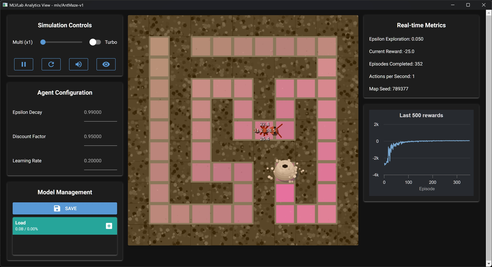

# AntMaze-v1 (Dungeons & Pheromones): Usage Guide

[](./README.md)
[](./README_es.md)

This file documents the `mlv/AntMaze-v1` environment, also known as **Dungeons & Pheromones**.



## Description

In `AntMaze`, the student takes control of the learning process. An ant must navigate through a procedurally generated dungeon (maze) to find the exit. The goal is not just to solve the maze, but to understand how manipulating the fundamental hyperparameters of Reinforcement Learning (Alpha, Gamma, Epsilon) affects the agent's behavior and learning speed in real-time.

This simulation is designed to provide an interactive understanding of the exploration vs. exploitation dilemma and the impact of learning rate and discount factor.

---

## Thematic Interpretation

The hyperparameters are themed to match the dungeon scenario:

*   **Alpha (Learning Rate) → Pheromone Intensity:** How strongly the ant reinforces a path after taking it. A high value means rapid adaptation to new information; a low value means gradual learning.
*   **Gamma (Discount Factor) → Future Vision:** How much the ant values future rewards (the exit) compared to immediate ones. A high value encourages long-term planning, crucial in mazes.
*   **Epsilon (Exploration Rate) → Bravery (Exploration):** The probability that the ant ignores its knowledge (pheromones) and tries a new random path.

---

## Technical Specifications

### Environment Configuration

The environment can be customized when creating it:

*   `grid_size`: The size of the square dungeon (e.g., 15 for 15x15). Default is 15.
*   If `grid_size >= 10`, a complex maze is generated using Recursive Backtracking and BFS to ensure a challenging but always valid path.
*   If `grid_size < 10`, a simpler scenario is generated with random walls.

### Observation Space

```python
Box(0, GRID_SIZE-1, (2,), int32)
```

*   **Meaning:** Vector `[x, y]` representing the ant's position.

### Action Space

```python
Discrete(4)
```

*   `0`: Up, `1`: Down, `2`: Left, `3`: Right.

---

## Environment Dynamics

### Rewards

*   **`+100`**: For reaching the dungeon exit.
*   **`-10`**: For hitting a wall.
*   **`-1`**: For each step taken.

### Episode End

*   **`terminated = True`**: The agent reaches the exit.
*   **`truncated = True`**: The maximum step limit is reached.

**Note:** If the ant hits a wall, it receives the penalty but **the episode does not end**. The ant remains in its current cell.

### Reset Behavior

When calling `reset()` without `seed`, the current dungeon is preserved and the ant returns to the start. A new dungeon is only generated if a `seed` is provided.

---

## Pheromone Visualization (Debug Mode)

When activating `debug` mode (Show Pheromones) in the interactive view, the learned Q-Table is visualized as a "pheromone trail". The color varies from pale pink (low value) to intense pink (high value), indicating the ant's preferred path.

---

## Interaction (View Mode) - Recommended

The main method to interact with this environment is through `view` mode, which provides real-time controls for hyperparameters.

```bash
# Start MLVisual shell
uv run mlv shell

# Launch interactive view
view AntMaze-v1
```

In view mode:

1. Start the simulation.
2. Adjust the Alpha, Gamma, and Epsilon Decay sliders in real-time.
3. Activate "Debug Mode" to visualize the pheromone trail and observe how changes affect learning.

## Script and Notebook Compatibility

```python
# Run a random episode in a notebook
import gymnasium as gym
import mlvlab # Make sure mlvlab is installed and the environment is registered

# Create a 15x15 maze
try:
    env = gym.make("mlv/AntMaze-v1", render_mode="human", grid_size=15)
    obs, info = env.reset(seed=42)
    terminated = truncated = False

    while not (terminated or truncated):
        action = env.action_space.sample()
        obs, reward, terminated, truncated, info = env.step(action)
    env.close()
except gym.error.NameNotFound:
    print("Error: mlv/AntMaze-v1 not registered.")
```

```python
# Tabular training (Q-Table) basic example
import numpy as np
import gymnasium as gym
import mlvlab

try:
    env = gym.make("mlv/AntMaze-v1", grid_size=15)
    GRID = int(env.unwrapped.GRID_SIZE)
    N_S, N_A = GRID * GRID, 4 # We use only the 4 movement actions for learning
    Q = np.zeros((N_S, N_A), dtype=np.float32)

    def obs_to_state(obs):
        x, y = int(obs[0]), int(obs[1])
        return y * GRID + x

    # Hyperparameters
    alpha, gamma, eps = 0.1, 0.95, 1.0
    eps_decay = 0.999

    for ep in range(500):
        obs, info = env.reset()
        s = obs_to_state(obs)
        done = False
        while not done:
            if np.random.rand() < eps:
                a = np.random.randint(N_A)
            else:
                a = int(Q[s].argmax())

            obs2, r, term, trunc, info = env.step(a)
            s2 = obs_to_state(obs2)

            # Q-Learning update rule
            Q[s, a] = (1 - alpha) * Q[s, a] + alpha * (r + gamma * Q[s2].max())
            s = s2
            done = term or trunc

        # Epsilon decay
        eps = max(0.01, eps * eps_decay)

    env.close()
except gym.error.NameNotFound:
    print("Error: mlv/AntMaze-v1 not registered.")
```

---

## Environment Actions (Optional)

The `AntMaze` environment includes special action functions that can be called directly for testing and experimentation purposes:

### `action_shift()`

This function allows you to change the maze while preserving the learned Q-Table, enabling continuous learning across different environments:

```python
# In scripts or notebooks
obs, info = env.action_shift()
```

**What it does:**
1. **Blocks Q-Values**: Temporarily locks the Q-Table to prevent updates during the transition
2. **Changes Map**: Generates a new maze layout while keeping the same grid size
3. **Unlocks Q-Values**: Re-enables learning, allowing the agent to continue improving with the new maze

**Use Cases:**
- **Testing Adaptation**: See how well your trained agent adapts to new maze layouts
- **Continuous Learning**: Maintain learning progress while exploring different environments
- **Research**: Study transfer learning and generalization capabilities

**Note:** These actions are automatically mapped in the interactive views, so you don't need to implement them manually in your training loops.
