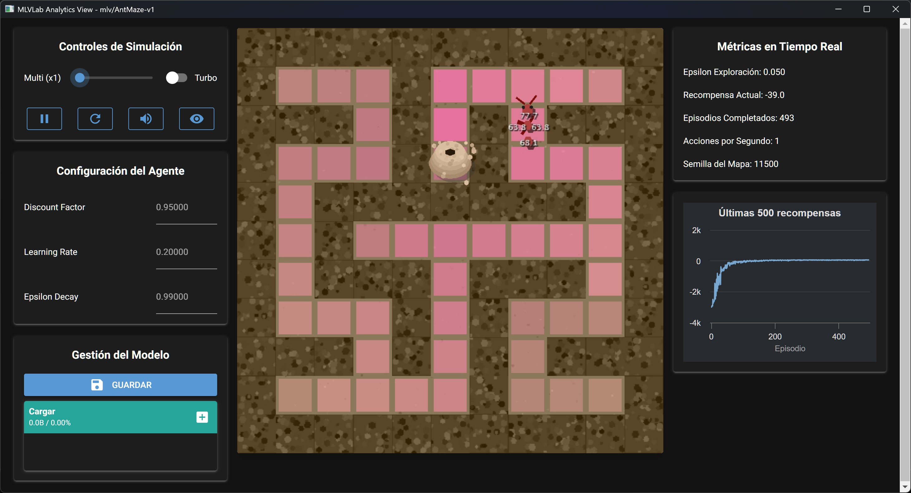

# AntMaze-v1 (Dungeons & Pheromones): Guía de Uso

[](./README.md)
[](./README_es.md)

Este archivo documenta el entorno `mlv/AntMaze-v1`, también conocido como **Dungeons & Pheromones**.

<!--  -->
*(Imagen de referencia pendiente)*

## Descripción

En `AntMaze`, el estudiante toma el control del proceso de aprendizaje. Una hormiga debe navegar por una mazmorra (laberinto) generada proceduralmente para encontrar la salida. El objetivo no es solo resolver el laberinto, sino comprender cómo la manipulación de los hiperparámetros fundamentales del Reinforcement Learning (Alpha, Gamma, Epsilon) afecta el comportamiento del agente y la velocidad de aprendizaje en tiempo real.

Esta simulación está diseñada para proporcionar una comprensión interactiva del dilema exploración vs. explotación y el impacto del ratio de aprendizaje y el factor de descuento.

---

## Interpretación Temática

Los hiperparámetros están tematizados para coincidir con el escenario de la mazmorra:

*   **Alpha (Learning Rate) → Intensidad de las Feromonas:** Qué tan fuertemente la hormiga refuerza un camino después de tomarlo. Un valor alto significa adaptación rápida a nueva información; un valor bajo significa aprendizaje gradual.
*   **Gamma (Discount Factor) → Visión de Futuro:** Cuánto valora la hormiga las recompensas futuras (la salida) en comparación con las inmediatas. Un valor alto fomenta la planificación a largo plazo, crucial en laberintos.
*   **Epsilon (Exploration Rate) → Valentía (Exploración):** La probabilidad de que la hormiga ignore su conocimiento (feromonas) e intente un camino nuevo y aleatorio.

---

## Especificaciones Técnicas

### Configuración del Entorno

El entorno se puede personalizar al crearlo:

*   `grid_size`: El tamaño de la mazmorra cuadrada (ej. 15 para 15x15). Por defecto es 15.
*   Si `grid_size >= 10`, se genera un laberinto complejo usando Recursive Backtracking y BFS para asegurar un camino desafiante pero siempre válido.
*   Si `grid_size < 10`, se genera un escenario más simple con muros aleatorios.
*   `enable_ant_shift`: (Booleano) Si es `True`, activa la funcionalidad para la simulación `AntShift`, añadiendo una 5ª acción.

### Espacio de Observación

```python
Box(0, GRID_SIZE-1, (2,), int32)
```

*   **Significado:** Vector `[x, y]` que representa la posición de la hormiga.

### Espacio de Acción

```python
Discrete(4)  # O Discrete(5) si enable_ant_shift=True
```

*   `0`: Arriba, `1`: Abajo, `2`: Izquierda, `3`: Derecha.
*   `4`: (Solo AntShift) Activar cambio de mapa y bloqueo de Q-Table (Tecla 'L').

---

## Dinámica del Entorno

### Recompensas

*   **`+100`**: Por alcanzar la salida de la mazmorra.
*   **`-10`**: Por chocar contra un muro.
*   **`-1`**: Por cada paso dado.

### Fin del Episodio

*   **`terminated = True`**: El agente alcanza la salida.
*   **`truncated = True`**: Se alcanza el límite máximo de pasos.

**Nota:** Si la hormiga choca contra un muro, recibe la penalización pero **el episodio no termina**. La hormiga permanece en su celda actual.

### Comportamiento del Reset

Al llamar a `reset()` sin `seed`, la mazmorra actual se conserva y la hormiga vuelve al inicio. Solo se genera una nueva mazmorra si se proporciona una `seed`.

---

## Visualización de Feromonas (Modo Debug)

Al activar el modo `debug` (Mostrar Feromonas) en la vista interactiva, la Q-Table aprendida se visualiza como un "rastro de feromonas". El color varía desde rosa pálido (bajo valor) hasta rosa intenso (alto valor), indicando el camino preferido por la hormiga.

---

## Interacción (Modo View) - Recomendado

El método principal para interactuar con este entorno es a través del modo `view`, que proporciona controles en tiempo real para los hiperparámetros.

```bash
# Iniciar el shell de MLVisual
uv run mlv shell

# Lanzar la vista interactiva
view AntMaze-v1
```

En el modo view:

1. Inicia la simulación.
2. Ajusta los sliders de Alpha, Gamma y Epsilon Decay en tiempo real.
3. Activa el "Modo Debug" para visualizar el rastro de feromonas y observa cómo los cambios afectan el aprendizaje.
    
## Funcionalidad Avanzada

```bash
# Lanzar la vista en modo AntShift
view AntMaze-v1 --kwargs '{"enable_ant_shift": true}'
```

```bash
# Jugar interactivamente (usando controles de teclado)
play AntMaze-v1

# Entrenar un agente con parámetros por defecto en una semilla específica
train AntMaze-v1 --seed 42

# Entrenar en una cuadrícula más grande
train AntMaze-v1 --kwargs '{"grid_size": 25}'
```

## Compatibilidad con Scripts y Notebooks

```python
# Ejecutar un episodio aleatorio en un notebook
import gymnasium as gym
import mlvlab # Asegúrate de que mlvlab esté instalado y el entorno registrado

# Crear un laberinto de 15x15
try:
    env = gym.make("mlv/AntMaze-v1", render_mode="human", grid_size=15)
    obs, info = env.reset(seed=42)
    terminated = truncated = False

    while not (terminated or truncated):
        action = env.action_space.sample()
        obs, reward, terminated, truncated, info = env.step(action)
    env.close()
except gym.error.NameNotFound:
    print("Error: mlv/AntMaze-v1 no registrado.")
```

```python
# Entrenamiento tabular (Q-Table) ejemplo básico
import numpy as np
import gymnasium as gym
import mlvlab

try:
    env = gym.make("mlv/AntMaze-v1", grid_size=15)
    GRID = int(env.unwrapped.GRID_SIZE)
    N_S, N_A = GRID * GRID, 4 # Usamos solo las 4 acciones de movimiento para aprender
    Q = np.zeros((N_S, N_A), dtype=np.float32)

    def obs_to_state(obs):
        x, y = int(obs[0]), int(obs[1])
        return y * GRID + x

    # Hiperparámetros
    alpha, gamma, eps = 0.1, 0.95, 1.0
    eps_decay = 0.999

    for ep in range(500):
        obs, info = env.reset()
        s = obs_to_state(obs)
        done = False
        while not done:
            if np.random.rand() < eps:
                a = np.random.randint(N_A)
            else:
                a = int(Q[s].argmax())

            obs2, r, term, trunc, info = env.step(a)
            s2 = obs_to_state(obs2)

            # Regla de actualización Q-Learning
            Q[s, a] = (1 - alpha) * Q[s, a] + alpha * (r + gamma * Q[s2].max())
            s = s2
            done = term or trunc

        # Decaimiento de Epsilon
        eps = max(0.01, eps * eps_decay)

    env.close()
except gym.error.NameNotFound:
    print("Error: mlv/AntMaze-v1 no registrado.")
```
