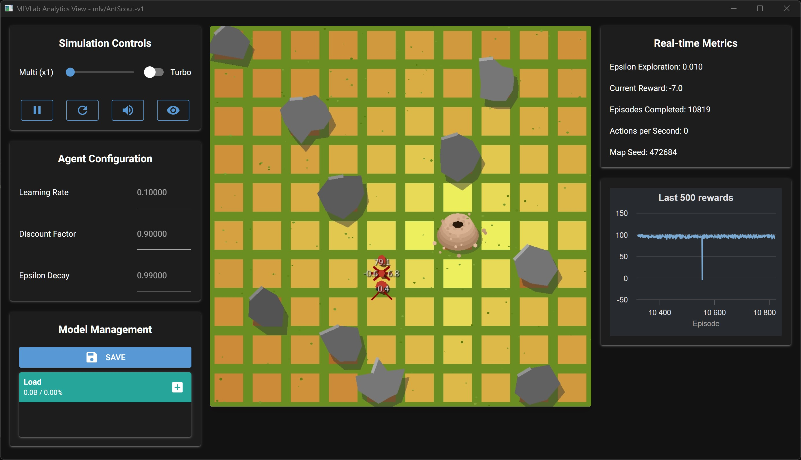

# AntScout-v1: Usage Guide

[](./README.md)
[](./README_es.md)

This file documents the `mlv/AntScout-v1` environment, also known as **Lookout Scout**.



## Description

In this environment, an agent (the ant) is placed on a 10x10 grid. The ant's objective is to find its colony (the goal) in the minimum number of steps possible, while avoiding obstacles scattered throughout the map.

This is a classic **Grid World navigation problem**, designed to teach the fundamentals of tabular reinforcement learning.

---

## Technical Specifications

### Observation Space

The observation space defines what the agent "sees" at each step.
```
Box(0, 9, (2,), int32)
```
* **Meaning:** The observation is a vector with 2 integers representing the ant's position `[x, y]` on the grid.
* **Bounds:** Each coordinate ranges from 0 to 9, corresponding to a 10x10 grid.
* **Total States:** $10 \times 10 = 100$ unique possible states.

### Action Space

The action space defines what movements the agent can perform.
```
Discrete(4)
```
* **Meaning:** The agent can choose one of 4 discrete actions, represented by an integer:
    * `0`: Move **Up** (decreases the `y` coordinate)
    * `1`: Move **Down** (increases the `y` coordinate)
    * `2`: Move **Left** (decreases the `x` coordinate)
    * `3`: Move **Right** (increases the `x` coordinate)

---

## Environment Dynamics

### Rewards

The agent receives a signal (reward) after each action to guide its learning:
* **`+100`**: For reaching the colony (the goal).
* **`-100`**: For hitting an obstacle.
* **`-1`**: For each step taken. This incentivizes the agent to find the shortest path.

### Episode End (Termination & Truncation)

An "episode" (an attempt to find the colony) ends under the following conditions:
* **`terminated = True`**: The agent reaches the colony. The episode ends successfully.
* **`truncated = True`**: The agent reaches the maximum step limit (`max_episode_steps=500`) without finding the colony. This prevents the agent from wandering indefinitely.

**Important note:** If the ant hits an obstacle, it receives the `-100` penalty but **the episode does not end**. Instead, the ant is returned to the cell it was in before hitting the obstacle.

---

## Additional Information (`info`)

Both `reset()` and `step()` return an **`info`** dictionary, useful for debugging but **not intended to be used directly for training**.

---

### In `reset()`
| Key        | Description                                  |
|------------|----------------------------------------------|
| `goal_pos` | Array with the `[x, y]` coordinates of the goal (target). |

---

### In `step()`
| Key          | Description |
|--------------|-------------|
| `goal_pos`   | Array with the `[x, y]` coordinates of the goal (target). |
| `collided`   | `True` if the ant collided with an obstacle or moved out of the grid boundaries. |
| `terminated` | `True` if the episode ended because the ant reached the goal. |
| `play_sound` | Dictionary with sound information:<br>• `{'filename': 'success.wav', 'volume': 10}` → when the goal is reached.<br>• `{'filename': 'bump.wav', 'volume': 7}` → when an obstacle is hit. |

---

## Recommended Training Strategy

### Algorithm: Q-Learning (tabular)

The combination of a **discrete and small state space (100 states)** and a **discrete action space (4 actions)** makes this environment a perfect candidate for tabular algorithms like **Q-Learning**.

This method learns by creating a "lookup table" (the Q-Table) that stores the expected value for each action in each of the 100 cells, allowing the agent to determine the optimal policy.

---

## Shell Usage Examples

```bash
# Start the MLVisual shell
uv run mlv shell

# Play interactively in the environment
play AntScout-v1

# Train an agent for a specific seed (e.g., 42)
train AntScout-v1 --seed 42

# Train with a random seed
train AntScout-v1

# Evaluate the latest training in window mode
eval AntScout-v1

# Evaluate a training with a specific seed
eval AntScout-v1 --seed 42

# Evaluate a training of 100 episodes
eval AntScout-v1 --seed --eps 100

# Launch an interactive view to manipulate the environment using controls
view AntScout-v1

# View this technical specification from the terminal
docs AntScout-v1
```

---

## Scripts and Notebook Compatibility

You can use **mlvlab** both in standalone scripts and interactive environments (Jupyter, Google Colab, etc.).  

---

### 1. Using Python Scripts

Create a dedicated virtual environment and install `mlvlab`:

```bash
# (Optional) Create a dedicated virtual environment
uv venv

# Install mlvlab inside that virtual environment
uv pip install mlvlab

# Run your script within the virtual environment
uv run python my_script.py
```

### 2. Using Jupyter Notebooks

Simply select your virtual environment as the kernel, or launch Jupyter with:

```bash
uv run jupyter notebook
```

### 3. Using Google Colab

Install `mlvlab` directly in the Colab session:

```bash
!pip install mlvlab
```

### Quick examples for notebooks

```python
# Run a random episode
import gymnasium as gym
import mlvlab  # registers the "mlv/..." environments

env = gym.make("mlv/AntScout-v1", render_mode="human")
obs, info = env.reset(seed=42)
terminated = truncated = False

while not (terminated or truncated):
    action = env.action_space.sample()
    obs, reward, terminated, truncated, info = env.step(action)
env.close()
```

```python
# Tabular training with Q-Learning agent from the package
from mlvlab.agents.q_learning import QLearningAgent
import gymnasium as gym
import mlvlab  # registers the "mlv/..." environments

env = gym.make("mlv/AntScout-v1")
obs, info = env.reset(seed=42)

agent = QLearningAgent(
    observation_space=env.observation_space,
    action_space=env.action_space,
    learning_rate=0.1,
    discount_factor=0.99,
    epsilon=1.0,
    epsilon_decay=0.995,
    min_epsilon=0.01
)

n_steps = 100
for _ in range(n_steps):
    action = agent.act(obs)
    next_obs, reward, terminated, truncated, info = env.step(action)
    agent.learn(obs, action, reward, next_obs, terminated)
    obs = next_obs
    if terminated or truncated:
        obs, info = env.reset()
env.close()
``` 

```python
# Tabular training (Q-Table) with simplified algorithm
import numpy as np
import gymnasium as gym
import mlvlab  # registers the "mlv/..." environments

env = gym.make("mlv/AntScout-v1")
GRID = int(env.unwrapped.GRID_SIZE)
N_S, N_A = GRID * GRID, env.action_space.n
Q = np.zeros((N_S, N_A), dtype=np.float32)

def obs_to_state(obs):
    x, y = int(obs[0]), int(obs[1])
    return y * GRID + x

alpha, gamma, eps = 0.1, 0.9, 1.0
for ep in range(100):
    obs, info = env.reset(seed=42)
    s = obs_to_state(obs)
    done = False
    while not done:
        a = np.random.randint(N_A) if np.random.rand() < eps else int(Q[s].argmax())
        obs2, r, term, trunc, info = env.step(a)
        s2 = obs_to_state(obs2)
        Q[s, a] = (1 - alpha) * Q[s, a] + alpha * (r + gamma * Q[s2].max())
        s = s2
        done = term or trunc
    eps = max(0.05, eps * 0.995)
env.close()
```

**Suggestion**: Save and load the Q-Table/weights to reuse them between sessions. You can also train from the shell and evaluate in notebook, or vice versa.
