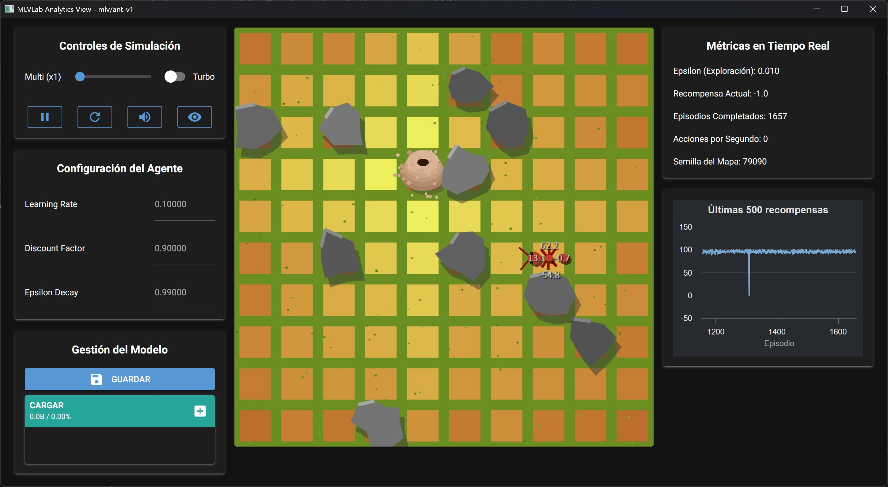

# Environment: Ant (LostAntEnv)

<div style="position: absolute; top: 15px; right: 15px;">
    <a href="./README.md">
        
    </a>
    <a href="./README_es.md" style="margin-left: 8px;">
        
    </a>
</div>

This file documents the `mlv/AntScout-v1` environment, also known as "The Lost Colony".



## Description

In this environment, an agent (the ant) is placed on a 15x15 grid. The ant's objective is to find its colony (the goal) in the minimum number of steps possible, while avoiding obstacles scattered throughout the map.

This is a classic **Grid World navigation problem**, designed to teach the fundamentals of tabular reinforcement learning.

---

## Technical Specifications

### Observation Space

The observation space defines what the agent "sees" at each step.
```
Box(0, 14, (2,), int32)
```
* **Meaning:** The observation is a vector with 2 integers representing the ant's position `[x, y]` on the grid.
* **Bounds:** Each coordinate ranges from 0 to 14, corresponding to a 15x15 grid.
* **Total States:** $15 \times 15 = 225$ unique possible states.

### Action Space

The action space defines what movements the agent can perform.
```
Discrete(4)
```
* **Meaning:** The agent can choose one of 4 discrete actions, represented by an integer:
    * `0`: Move **Up** (decreases the `y` coordinate)
    * `1`: Move **Down** (increases the `y` coordinate)
    * `2`: Move **Left** (decreases the `x` coordinate)
    * `3`: Move **Right** (increases the `x` coordinate)

---

## Environment Dynamics

### Rewards

The agent receives a signal (reward) after each action to guide its learning:
* **`+100`**: For reaching the colony (the goal).
* **`-100`**: For hitting an obstacle.
* **`-1`**: For each step taken. This incentivizes the agent to find the shortest path.

### Episode End (Termination & Truncation)

An "episode" (an attempt to find the colony) ends under the following conditions:
* **`terminated = True`**: The agent reaches the colony. The episode ends successfully.
* **`truncated = True`**: The agent reaches the maximum step limit (`max_episode_steps=500`) without finding the colony. This prevents the agent from wandering indefinitely.

**Important note:** If the ant hits an obstacle, it receives the `-100` penalty but **the episode does not end**. Instead, the ant is returned to the cell it was in before hitting the obstacle.

---

## Additional Information (Info Dictionary)

The `reset()` and `step()` functions return an `info` dictionary containing useful data for debugging, but should not be used directly for training.
* `info['food_pos']`: Returns an array with the colony coordinates `[x, y]`.

---

## Recommended Training Strategy

### Algorithm: Q-Learning (tabular)

The combination of a **discrete and small state space (225 states)** and a **discrete action space (4 actions)** makes this environment a perfect candidate for tabular algorithms like **Q-Learning**.

This method learns by creating a "lookup table" (the Q-Table) that stores the expected value for each action in each of the 225 cells, allowing the agent to determine the optimal policy.

---

## CLI Usage Examples

```bash
# Play interactively in the environment
mlv play AntScout-v1

# Train an agent for a specific seed (e.g., 42)
mlv train AntScout-v1 --seed 42

# Train with a random seed
mlv train AntScout-v1

# Evaluate the latest training in window mode
mlv eval AntScout-v1

# Evaluate a training with a specific seed
mlv eval AntScout-v1 --seed 42

# Evaluate a training in headless mode recording a video of 100 episodes
mlv eval AntScout-v1 --rec --eps 100

# Launch an interactive view to manipulate the environment using controls
mlv view AntScout-v1

# View this technical specification from the terminal
mlv docs AntScout-v1
```

---

## Notebook Compatibility

You can experiment with this environment directly from Jupyter or Google Colab.

Quick examples for notebooks:

```bash
# (Optional) Installation if you're in Colab
pip install -U git+https://github.com/hcosta/mlvlab
```

```python
# 1) Create the environment and run a random episode
import gymnasium as gym
import mlvlab  # registers the "mlv/..." environments

env = gym.make("mlv/AntScout-v1", render_mode="human")
obs, info = env.reset(seed=42)
terminated = truncated = False
while not (terminated or truncated):
    action = env.action_space.sample()
    obs, reward, terminated, truncated, info = env.step(action)
env.close()
```

```python
# 2) Simplified tabular training (Q-Table)
import numpy as np
import gymnasium as gym
import mlvlab

env = gym.make("mlv/AntScout-v1")
GRID = int(env.unwrapped.GRID_SIZE)
N_S, N_A = GRID * GRID, env.action_space.n
Q = np.zeros((N_S, N_A), dtype=np.float32)

def obs_to_state(obs):
    x, y = int(obs[0]), int(obs[1])
    return y * GRID + x

alpha, gamma, eps = 0.1, 0.9, 1.0
for ep in range(100):
    obs, info = env.reset(seed=123)
    s = obs_to_state(obs)
    done = False
    while not done:
        a = np.random.randint(N_A) if np.random.rand() < eps else int(Q[s].argmax())
        obs2, r, term, trunc, info = env.step(a)
        s2 = obs_to_state(obs2)
        Q[s, a] = (1 - alpha) * Q[s, a] + alpha * (r + gamma * Q[s2].max())
        s = s2
        done = term or trunc
    eps = max(0.05, eps * 0.995)
env.close()
```

Suggestion: save and load the Q-Table/weights to reuse them between sessions. You can also train from the CLI and evaluate in notebook, or vice versa.
