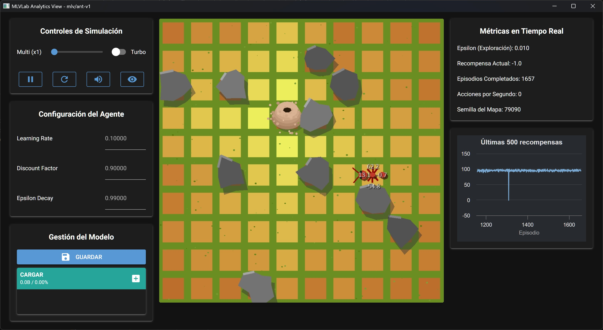

# AntScout-v1: Guía de Uso

[](./README.md)
[](./README_es.md)

Este fichero documenta el entorno `mlv/AntScout-v1`, también conocido como **Exploradora Vigía**.



## Descripción

En este entorno, un agente (la hormiga) se encuentra en una rejilla de 10x10. El objetivo de la hormiga es encontrar su hormiguero (la meta) en el menor número de pasos posible, mientras evita los obstáculos repartidos por el mapa.

Este es un problema clásico de **navegación en un Grid World**, diseñado para enseñar los fundamentos del aprendizaje por refuerzo tabular.

---

## Ficha Técnica

### Observation Space

El espacio de observación define lo que el agente "ve" en cada paso.
```
Box(0, 9, (2,), int32)
```
* **Significado:** La observación es un vector con 2 números enteros, que representan la posición `[x, y]` de la hormiga en la rejilla.
* **Límites:** Cada coordenada va de 0 a 9, correspondiendo a una rejilla de 10x10.
* **Total de Estados:** $10 \times 10 = 100$ estados únicos posibles.

### Action Space

El espacio de acciones define qué movimientos puede realizar el agente.
```
Discrete(4)
```
* **Significado:** El agente puede elegir una de 4 acciones discretas, representadas por un número entero:
    * `0`: Moverse **Arriba** (disminuye la coordenada `y`)
    * `1`: Moverse **Abajo** (aumenta la coordenada `y`)
    * `2`: Moverse a la **Izquierda** (disminuye la coordenada `x`)
    * `3`: Moverse a la **Derecha** (aumenta la coordenada `x`)

---

## Dinámica del Entorno

### Recompensas (Rewards)

El agente recibe una señal (recompensa) después de cada acción para guiar su aprendizaje:
* **`+100`**: Por llegar al hormiguero (la meta).
* **`-100`**: Por chocar contra un obstáculo.
* **`-1`**: Por cada paso que da. Esto incentiva al agente a encontrar la ruta más corta.

### Fin del Episodio (Termination & Truncation)

Un "episodio" (un intento de encontrar el hormiguero) termina bajo las siguientes condiciones:
* **`terminated = True`**: El agente llega al hormiguero. El episodio termina con éxito.
* **`truncated = True`**: El agente alcanza el límite máximo de pasos (`max_episode_steps=500`) sin encontrar el hormiguero. Esto evita que el agente vague indefinidamente.

**Nota importante:** Si la hormiga choca contra un obstáculo, recibe la penalización de `-100` pero **el episodio no termina**. En su lugar, la hormiga es devuelta a la casilla en la que estaba antes de chocar.

---

## Información Adicional (`info`)

Tanto `reset()` como `step()` devuelven un diccionario **`info`**, útil para depuración pero **no recomendado para usar directamente en el entrenamiento**.

---

### En `reset()`
| Clave              | Descripción                                        |
|---------------------|----------------------------------------------------|
| `goal_pos`         | Coordenadas `[x, y]` de la meta (objetivo).        |

---

### En `step()`
| Clave              | Descripción |
|---------------------|-------------|
| `goal_pos`         | Coordenadas `[x, y]` de la meta (objetivo). |
| `collided`         | `True` si la hormiga colisiona o sale de los límites del grid. |
| `terminated`       | `True` si el episodio termina porque la hormiga alcanzó la meta. |
| `play_sound`       | Diccionario con información de sonido:<br>• `{'filename': 'success.wav', 'volume': 10}` → al alcanzar la meta.<br>• `{'filename': 'bump.wav', 'volume': 7}` → al colisionar con un obstáculo. |

---

## Estrategia de Entrenamiento Recomendada

### Algoritmo: Q-Learning (tabular)

La combinación de un **espacio de estados discreto y pequeño (100 estados)** y un **espacio de acciones discreto (4 acciones)** hace que este entorno sea un candidato perfecto para algoritmos tabulares como **Q-Learning**.

Este método aprende creando una "tabla de consulta" (la Q-Table) que almacena el valor esperado para cada acción en cada una de las 100 casillas, permitiendo al agente determinar la política óptima.

---

## Ejemplos de Uso con el Shell

```bash
# Inicia la terminal de MLVisual
uv run mlv shell

# Jugar interactivamente en el entorno
play AntScout-v1

# Entrenar un agente para una semilla específica (p. ej. 42)
train AntScout-v1 --seed 42

# Entrenar con una semilla aleatoria
train AntScout-v1

# Evaluar el último entrenamiento en modo ventana
eval AntScout-v1

# Evaluar un entrenamiento de una semilla específica
eval AntScout-v1 --seed 42

# Evaluar un entrenamiento de 100 episodios
eval AntScout-v1 --eps 100

# Lanza una vista interactiva para manipular el entorno usando controles
view AntScout-v1

# Ver esta ficha técnica desde la terminal
docs AntScout-v1
```

---

## Compatibilidad con Scripts y Notebooks

Puedes usar **mlvlab** tanto en scripts independientes como en entornos interactivos (Jupyter, Google Colab, etc.).  

---

### 1. Uso con Scripts de Python

Crea un entorno virtual dedicado e instala `mlvlab`:

```bash
# (Opcional) Crea un entorno virtual dedicado
uv venv

# Instala mlvlab dentro de ese entorno virtual
uv pip install mlvlab

# Ejecuta tu script dentro del entorno virtual
uv run python mi_script.py
```

### 2. Uso con Jupyter Notebooks

Simplemente selecciona tu entorno virtual como kernel, o lanza Jupyter con:

```bash
uv run jupyter notebook
```

### 3. Uso con Google Colab

Instala `mlvlab` directamente en la sesión de Colab:

```bash
!pip install mlvlab
```

###  Ejemplos rápidos para cuadernos

```python
# Crear el entorno y ejecutar un episodio aleatorio
import gymnasium as gym
import mlvlab  # registra los entornos "mlv/..."

env = gym.make("mlv/AntScout-v1", render_mode="human")
obs, info = env.reset(seed=42)
terminated = truncated = False

while not (terminated or truncated):
    action = env.action_space.sample()
    obs, reward, terminated, truncated, info = env.step(action)
env.close()
```

```python
# Entrenamiento tabular con agente Q-Learning del paquete
from mlvlab.agents.q_learning import QLearningAgent
import gymnasium as gym
import mlvlab  # registra los entornos "mlv/..."

env = gym.make("mlv/AntScout-v1")
obs, info = env.reset(seed=42)

agent = QLearningAgent(
    observation_space=env.observation_space,
    action_space=env.action_space,
    learning_rate=0.1,
    discount_factor=0.99,
    epsilon=1.0,
    epsilon_decay=0.995,
    min_epsilon=0.01
)

n_steps = 100
for _ in range(n_steps):
    action = agent.act(obs)
    next_obs, reward, terminated, truncated, info = env.step(action)
    agent.learn(obs, action, reward, next_obs, terminated)
    obs = next_obs
    if terminated or truncated:
        obs, info = env.reset()
env.close()
``` 

```python
# Entrenamiento tabular (Q-Table) con algoritmo simplificado
import numpy as np
import gymnasium as gym
import mlvlab  # registra los entornos "mlv/..."

env = gym.make("mlv/AntScout-v1")
GRID = int(env.unwrapped.GRID_SIZE)
N_S, N_A = GRID * GRID, env.action_space.n
Q = np.zeros((N_S, N_A), dtype=np.float32)

def obs_to_state(obs):
    x, y = int(obs[0]), int(obs[1])
    return y * GRID + x

alpha, gamma, eps = 0.1, 0.9, 1.0
for ep in range(100):
    obs, info = env.reset(seed=42)
    s = obs_to_state(obs)
    done = False
    while not done:
        a = np.random.randint(N_A) if np.random.rand() < eps else int(Q[s].argmax())
        obs2, r, term, trunc, info = env.step(a)
        s2 = obs_to_state(obs2)
        Q[s, a] = (1 - alpha) * Q[s, a] + alpha * (r + gamma * Q[s2].max())
        s = s2
        done = term or trunc
    eps = max(0.05, eps * 0.995)
env.close()
```

**Sugerencia**: Guarda y carga la Q-Table/pesos para reutilizarlos entre sesiones. También puedes entrenar desde el shell y evaluar en notebook, o al revés.